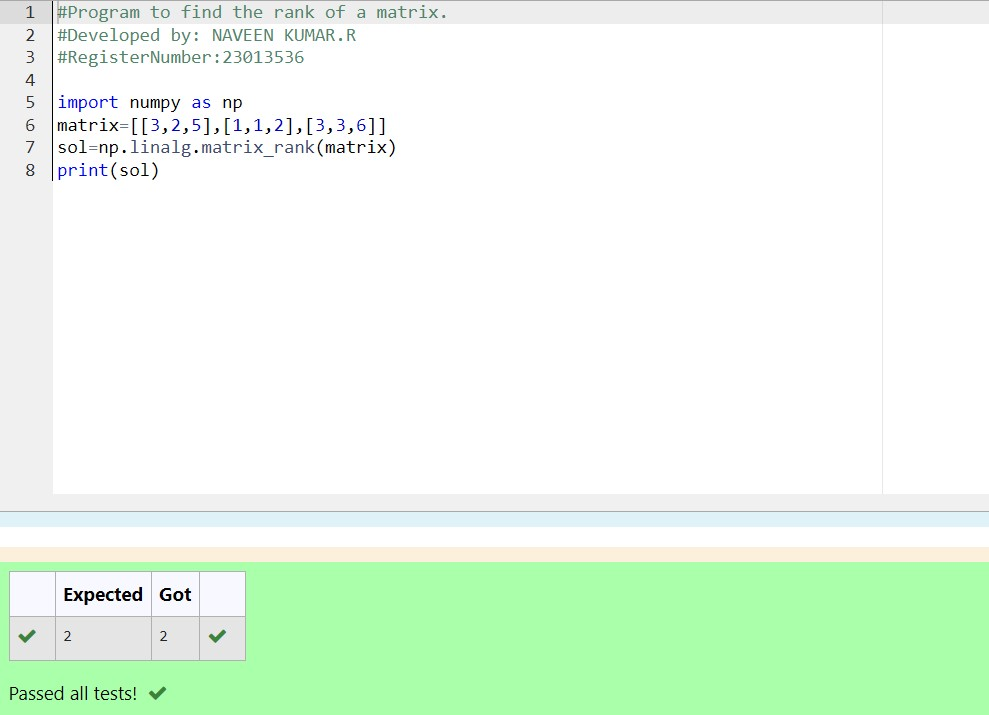

# RANK-OF-A-MATRIX
## Aim:
To write a python program to find the rank of a matrix
## Equipment’s required:
1. 	Hardware – PCs
2. 	Anaconda – Python 3.7 Installation / Moodle-Code Runner
## Algorithm:
## Step 1:
We have imported numpy which is needed.

## Step 2:
We have created a matrix by using np.array with different values in it.

## Step 3:
Using the np.linalg.matrix_rank(), we can find the rank of the given matrix.

## Step 4:
Finally, print the value of the rank of the matrix.

## Program:
```
#Program to find the rank of a matrix.
#Developed by: NAVEEN KUMAR.R
#RegisterNumber:23013536

import numpy as np
matrix=[[3,2,5],[1,1,2],[3,3,6]]
sol=np.linalg.matrix_rank(matrix)
print(sol)

```
## Output:


## Result:
Thus the rank for the given matrix is successfully solved by  using a python program.
